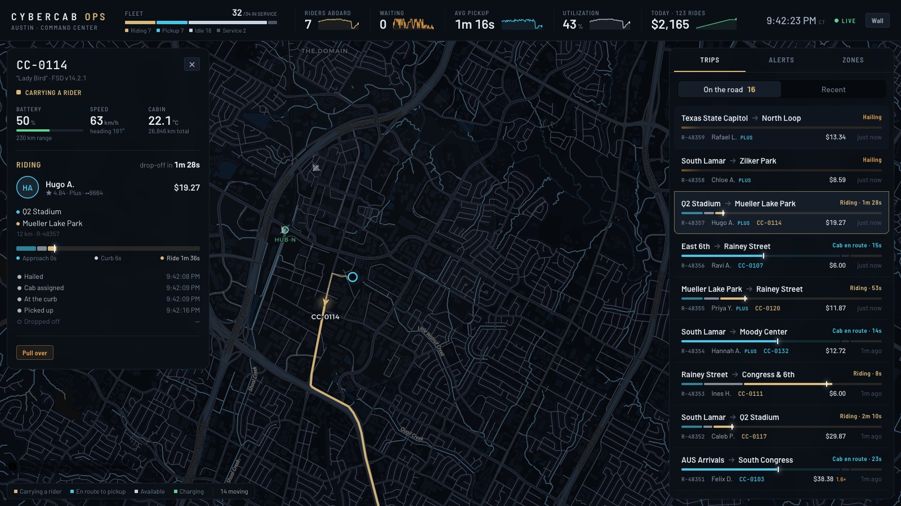
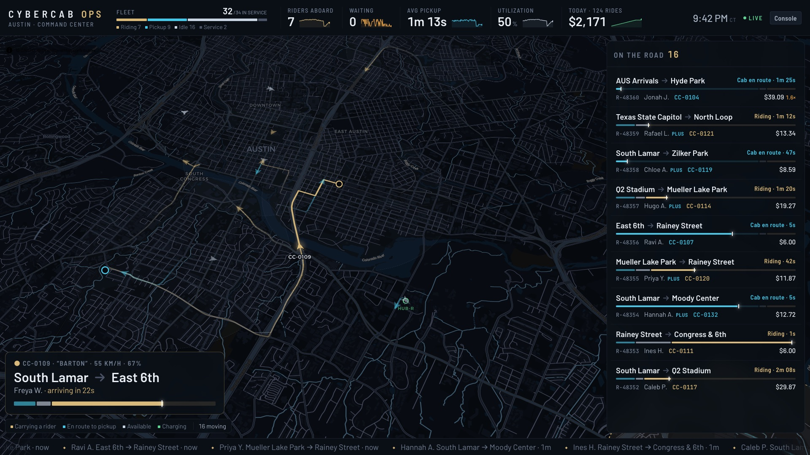

# Cybercab Command Center

The control room for a robotaxi fleet in Austin. Every cab is on a live map. Tap one to see
its rider and the trip so far. Along the side, trips appear the moment a rider hails and
progress until drop-off. Put it on a wall display with `?mode=wall`, or work at a desk in
console mode with the commands and detail panels.

The domain is written once in Rust with `ash-rust`. `ash-typescript` turns it into the
front end's typed client, Zod schemas and live React hooks. A simulated fleet drives real
Austin streets using nothing but the domain's own actions. What you see on the map, the
front end learned over a GraphQL subscription.





```bash
./run.sh                    # API on :4000, command center on http://localhost:4321
SIM_SPEED=4 DEMAND=1.5 ./run.sh
```

## The domain

Four bounded contexts, each a `domain!` (`server/src/lib.rs`). They refer to one another
only by id and relationship.

| Context       | Resources                                     | It owns                                                                        |
| ------------- | --------------------------------------------- | ------------------------------------------------------------------------------ |
| **Fleet**     | `Cab`, `Depot`                                | The vehicles: where each cab is, what it is doing, its battery, the hubs it charges at |
| **Riders**    | `Rider`                                       | Who rides: tier (Standard, Plus, Founder), rating, accessibility needs        |
| **Rides**     | `Trip`, `ServiceZone`                         | Each journey from hail to drop-off, and demand and surge pricing by zone       |
| **Telemetry** | `TelemetrySample`, `FleetAlert`, `PulseSample` | What the cabs report, what needs a person, and the room's vital signs over time |

The lifecycles are state machines (`ash-state-machine`). An operator can't put a cab or a
trip into a state its lifecycle doesn't allow, whether through the UI or the API.

```
Cab   available ─dispatch→ dispatched ─begin_ride→ on_trip ─finish_ride→ available
          │                    └─stand_down→ available
          └─recall→ returning ─plug_in→ charging ─unplug→ available
      available | returning | charging ─ground→ maintenance ─release→ available

Trip  requested ─assign→ assigned ─arrive→ arrived ─board→ riding ─complete→ completed
          └────────────────┴──────────────────┴─cancel→ cancelled

Alert open ─acknowledge→ acknowledged ─resolve→ resolved
```

Other actions:

- Telemetry and operator overrides are plain updates: `Cab.report` (position, speed,
  battery), and `Cab.pull_over` / `resume`.
- Zones are re-measured every tick (`ServiceZone.measure`), and operators can stage an
  event (`host_event` / `clear_event`) that draws riders and raises the surge.
- Aggregates answer questions without extra queries: a cab's `trips_completed` and
  `fares_cents`, and a depot's `cab_count` and `charging`.

## The simulation

`server/src/sim.rs` drives the fleet. It owns no state of its own. Each tick it:

1. **Reads the domain**, so operator commands take effect. A recalled cab heads to its hub,
   a pulled-over cab stops, and a cancelled pickup stands its cab down.
2. **Hails riders** across the zones. Demand is weighted by each zone's base demand and any
   event there.
3. **Dispatches** the nearest healthy cab. A rider gives up if no cab is found in time.
4. **Drives** cabs along real streets: to the pickup, a wait at the curb, then the ride.
   Battery drains with distance, and cabs that run low go back to a hub to charge.
5. **Measures** each zone's waiting riders and surge, and records a pulse sample for the
   sparklines.
6. **Raises and settles alerts**: low battery, hard braking, obstruction, rider assist,
   sensor degraded, door ajar.

Every change goes through an action, so every change is published. The front end updates
over the same subscription it would use with a real fleet.

The streets come from OpenStreetMap: 253 routes between Austin landmarks, simplified and
stored as encoded polylines in `server/data/routes.json`. `tools/bake-routes.mjs` rebuilds
them from the public OSRM demo server. Route data is © OpenStreetMap contributors, under
the ODbL.

| Variable    | Default | Meaning                                                  |
| ----------- | ------- | -------------------------------------------------------- |
| `SIM_SPEED` | `8`     | Simulated seconds per real second                        |
| `DEMAND`    | `1`     | Multiplies how often riders hail a cab                   |
| `SEED`      | `51893` | Seeds the fleet, the riders and the simulation's random choices |
| `PORT`      | `4000`  | The API's port                                           |

## Live data

`server/src/server.rs` generates the SDK with subscriptions turned on:

```rust
TypeScriptConfig::new()
    .with_zod(true)
    .with_client(true)
    .with_react(true)
    .with_subscriptions(true)
```

The front end then reads every list through a live hook. Each hook loads the query, keeps
it current from `onCreated` / `onUpdated` / `onDestroyed` over `/graphql/ws`, and reloads
after a reconnect:

```tsx
const { data: cabs } = useCabLive(client);
const { data: active } = useTripLive(
  client,
  { filter: { status: { in: ["requested", "assigned", "arrived", "riding"] } }, include: { rider: true } },
  { syncDelayMs: 300 },
);
const status = useAshConnectionStatus(client); // the "Live" light in the header
```

Operator commands are calls on the generated client:
`client.cab.recall(id, {})`, `client.trip.cancel(id, {...})`,
`client.fleetAlert.acknowledge(id, {...})`, and
`client.serviceZone.hostEvent(id, {...})`.

## The interface

The look is Austin at night. The palette:

- Asphalt-dark base map.
- Cybercab champagne gold for a cab carrying a rider, and for whatever is selected.
- Sensor cyan for a cab on its way to a pickup.
- Supercharger green for charging.
- Sodium-lamp amber for warnings, and brake-light red for anything critical.

- **The map** fills the screen, and the instruments sit over it on glass. Each cab is a
  chevron pointing where it's heading, with a short light trail. Selecting a cab draws its
  route ahead: cyan to the pickup, gold to the drop-off.
- **The journey ribbon** shows every trip in three parts, each sized by how long it took or
  is expected to take: the approach (cyan), the wait at the curb (white), and the ride
  (gold). A tick marks where the cab is now. It appears in the trip feed, the cab panel and
  the wall spotlight.
- **The pulse strip** runs along the top: the fleet by status, riders aboard, riders
  waiting, average pickup time, utilization and the day's takings, each with a sparkline of
  the last few minutes.
- **Console mode** is for a desk. Tap a cab for its telemetry, passenger, journey and
  milestones, and the commands its state allows. The rail has trips (on the road or recent),
  alerts with acknowledge and resolve, and zones where you can stage an event and watch the
  fleet respond.
- **Wall mode** (`?mode=wall`, or press `W`) is for a TV across the room. Everything is
  larger, with no controls. The map follows a spotlight that moves between rides in
  progress, and a ticker of the latest trips (hails, rides and drop-offs) runs along the
  bottom.

## Layout

```
server/src/
  lib.rs              the four domains
  fleet/ riders/ rides/ telemetry/   the resources, one file each
  city.rs             places, zones, hubs, and routes along real streets
  seed.rs             a morning's history: riders, the fleet, earlier trips
  sim.rs              the simulated fleet
  server.rs           the GraphQL router (HTTP + WebSocket) and the SDK config
  main.rs             writes the SDK, seeds, simulates, serves
server/data/          Austin: zones, landmarks, hubs, and the baked routes
frontend/src/
  lib/ash.ts          generated by ash-typescript (do not edit)
  lib/model.ts        statuses, colours, and a trip's journey
  components/         the map, pulse strip, rail, cab panel, journey ribbon
tests/                the simulation, the API over HTTP and WebSocket, and the SDK
```

## Tests

```bash
cargo test -p cybercab
```

- `tests/simulation.rs` drives the fleet: riders are carried from hail to drop-off,
  operators recall and halt cabs, a cancelled pickup stands its cab down, and an event lifts
  the surge.
- `tests/api.rs` covers the API: reads load their relationships, cab movements arrive over
  the WebSocket, and the state machines refuse commands a cab's state doesn't allow.
- `tests/sdk.rs` checks that `frontend/src/lib/ash.ts` matches the domain, and type-checks
  the front end against it. The type check is skipped locally until you run `bun install`;
  in CI it is required.
